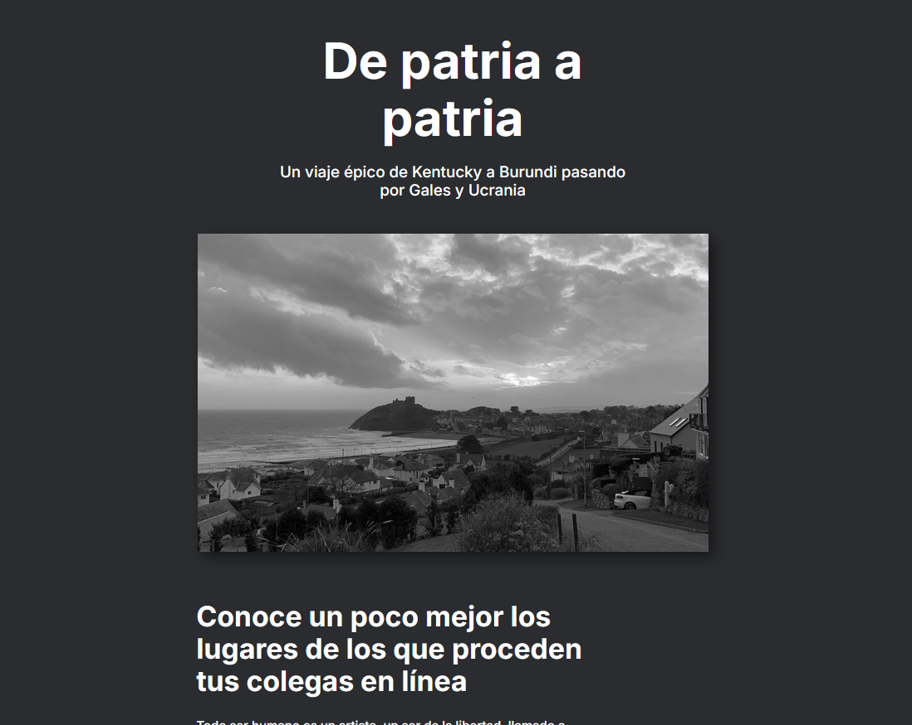

# Nombre del Proyecto 📛

web_project_homeland

## Descripción del Proyecto y su Funcionalidad 📖

Este proyecto tiene como objetivo mejorar mis habilidades en la creación de páginas responsivas para celulares, tablets y pantallas grandes. Proporciona ejemplos y ejercicios prácticos para adaptar el contenido web a diferentes tamaños de pantalla, asegurando una experiencia de usuario óptima en cualquier dispositivo.

## Descripción de las Tecnologías y Técnicas Utilizadas 🛠️

- **Lenguajes de Programación:** HTMLy CSS

- **Herramientas de Desarrollo:** VSCode, Git y Github.

## Demo del Proyecto

Puedes ver el proyecto en acción visitando este enlace: [web_project_homeland](https://zinderellasnuff.github.io/web_project_homeland/)

---

### Comentarios Básicos

Diseño Responsivo con CSS: Se han implementado técnicas de diseño responsivo utilizando media queries en CSS. Esto permite ajustar el diseño y el contenido de la página dependiendo del tamaño de la pantalla del dispositivo.
Uso de Git y GitHub: El control de versiones se ha gestionado con Git, y el código se ha alojado en un repositorio de GitHub para facilitar la colaboración y el despliegue continuo.
Imágenes y Multimedia Responsivas: Las imágenes y otros elementos multimedia se han optimizado para ser responsivos, utilizando unidades relativas y max-width para asegurar que se redimensionen adecuadamente.
